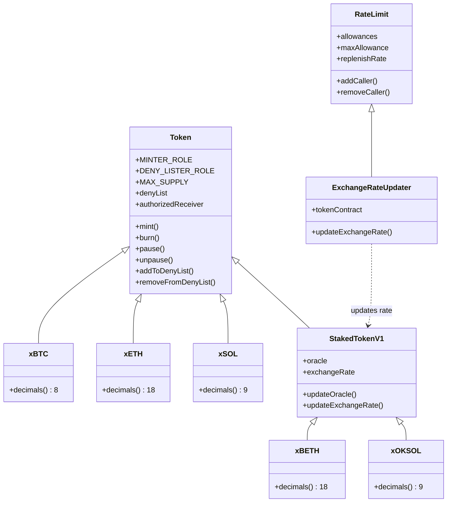

# OKX x-Assets

Upgradeable ERC-20 wrapped and staked token implementations on EVM

## Supported Tokens

### Wrapped Tokens
| Token | Deployed Address |
|-------|------------------|
| xBTC  | https://www.oklink.com/zh-hans/x-layer/token/0xb7C00000bcDEeF966b20B3D884B98E64d2b06b4f |
| xETH  | |
| xSOL  | |

### Staked Tokens
| Token   | Deployed Address |
|---------|------------------|
| xBETH   | |
| xOKSOL  | |

## Architecture



## Features

### Base Token Features
- **Regulated minting**: Only the minter can mint tokens to the designated receiver address
- **Admin-only burning**: Only the minter can burn tokens
- **Deny list (blacklist)**: Functionality to restrict certain addresses
- **Global pause**: Capability for emergency situations
- **Role-based governance**: Separate roles for minting and compliance management
- **Upgradeable**: Transparent proxy pattern for seamless contract upgrades
- **ERC-2612 Permit**: Gasless approvals via EIP-712 signatures

### Staked Token Features (xBETH, xOKSOL)
All base features plus:
- **Exchange rate oracle**: Dynamic rate updates for staked asset value
- **Oracle management**: Admin-controlled oracle address updates
- **Rate-limited exchange rate updates**: `ExchangeRateUpdater` contract limits the magnitude of exchange rate changes to prevent large unexpected fluctuations

## Technical Details

Built on OpenZeppelin's upgradeable contracts with:
- **Role-based Access Control**:
  - `MINTER_ROLE`: Controls token supply (mint/burn)
  - `DENY_LISTER_ROLE`: Controls deny list and pause operations
  - `DEFAULT_ADMIN_ROLE`: Controls role management and oracle (for staked tokens)
    - **Upgradeable Architecture**: Transparent proxy pattern for seamless contract upgrades
- **EIP-712 typed data signing**: For meta-transactions and permit

## Project Structure

```
xAssets/
├── contracts/
│   ├── Token.sol              # Base token implementation
│   ├── StakedTokenV1.sol      # Staked token with exchange rate
│   ├── ExchangeRateUpdater.sol # Rate-limited exchange rate updates
│   ├── RateLimit.sol          # Base rate limiting logic
│   ├── xBTC.sol               # Wrapped BTC (8 decimals)
│   ├── xETH.sol               # Wrapped ETH (18 decimals)
│   ├── xSOL.sol               # Wrapped SOL (9 decimals)
│   ├── xBETH.sol              # Staked ETH (18 decimals)
│   ├── xOKSOL.sol             # Staked SOL (9 decimals)
│   └── Proxy.sol              # Transparent upgradeable proxy
├── test/
│   ├── Token.t.sol          # Foundry tests for base token
│   ├── StakedTokenV1.t.sol  # Foundry tests for staked token
│   └── xBTC.*.test.ts       # Hardhat tests for xBTC
├── scripts/                 # Deployment and utility scripts
├── hardhat.config.ts        # Hardhat configuration
└── foundry.toml             # Foundry configuration
```

## Development

### Prerequisites
- Node.js >= 18
- Foundry (for Solidity tests)

### Installation
```bash
yarn
```

### Testing

#### Foundry Tests (Recommended for Solidity)
```bash
# Run all Foundry tests
forge test

# Run with verbosity
forge test -vvv

# Run specific test file
forge test --match-path test/Token.t.sol
```

#### Hardhat Tests
```bash
# Run all Hardhat tests
npx hardhat test

# Run specific test
npx hardhat test test/xBTC.comprehensive.test.ts
```

### Coverage
```bash
# Foundry coverage
forge coverage

# Hardhat coverage
npx hardhat coverage
```

## Deployment

### Using Foundry (Recommended)
```bash

```

### xBTC Hardhat Deployment

To deploy the xBTC token:

```bash
# Compile contracts
npx hardhat compile

# Deploy to local network
npx hardhat run scripts/deploy.ts

# Deploy to Sepolia testnet
npx hardhat run scripts/deploy.ts --network sepolia
```

Make sure you have Hardhat installed and configured correctly before running the deployment script.

## Credits

The staked token implementation (`StakedTokenV1.sol`) and exchange rate contracts (`ExchangeRateUpdater.sol`, `ExchangeRateUtil.sol`, `RateLimit.sol`) are derived from Coinbase's [wrapped-tokens-os](https://github.com/coinbase/wrapped-tokens-os) project (cbETH).

## License

MIT
